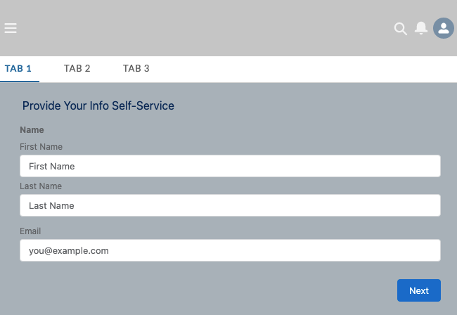

# Host Flow in a Visualforce page with Aura Component Dependency

## Requirements
* My Domain Enabled
* One Aura Application
* One Visualforce page
* One Screen Flow

| optional |
* Has a Community Site (or)
* Digial Experienc Enabled
* Have at least one published site to test
## To Customize
1. Have your screen flow ready and activated (Your flow should not have required input parameters to start the interview; this template is not built to supoprt it. ex. I need to start the flow interview with a list of selected records from the page)

2. [flowVF](force-app/main/default/pages/flowVF.page) LINE 22: Replace the Aura Application name `c:<name>` to yours, if it has a different name.

3. [flowVF](force-app/main/default/pages/flowVF.page) LINE 31: Replace the flow API name to your target flow.

4. Provide access to the flowVF page for relevant community user profiles.

5. Link or embed your flowVF page to your community or experience site

`This is a very very rough template`

#### Resource
Salesforce Documentation : [Render Lightning Runtime for Flows in a Visualforce Page](https://developer.salesforce.com/docs/atlas.en-us.pages.meta/pages/pages_flows_lightningruntime.htm)